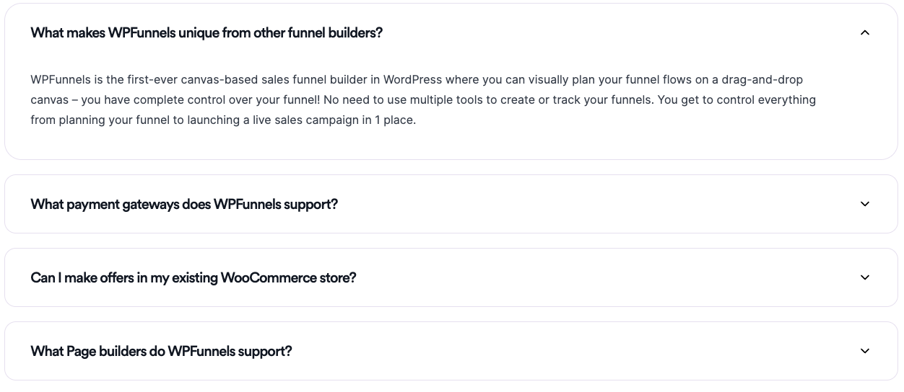

# Feature Pages and Common Sections
In this repository there are the common sections of feature pages of both WPFunnel and Mail Mint. Also there are includes feature pages developed. 

## Feature pages list
### WPFunnel
- [AB Testing Feature Page](https://kabir-coderex.github.io/website-common-sections/Pages/ABTesting-WPF/index.html) - [View Source Code](https://github.com/kabir-coderex/website-common-sections/tree/develop/Pages/ABTesting-WPF)

### Mail Mint
- [Automation Feature Page](https://kabir-coderex.github.io/website-common-sections/Pages/Automation-MM/index.html) - [View Source Code](https://github.com/kabir-coderex/website-common-sections/tree/develop/Pages/Automation-MM)

## Common Sections
- [Hero Section](https://kabir-coderex.github.io/website-common-sections/components/HeroSection/hero-section.html) - [Source Code](https://github.com/kabir-coderex/website-common-sections/tree/develop/components/HeroSection)
  

- [Card With Center Image](https://kabir-coderex.github.io/website-common-sections/components/CardWithCenterImage/index.html) - [Source Code](https://github.com/kabir-coderex/website-common-sections/tree/develop/components/CardWithCenterImage)
  

- [Card With Right Image](https://kabir-coderex.github.io/website-common-sections/components/CardWtihRightImage/index.html) - [Source Code](https://github.com/kabir-coderex/website-common-sections/tree/develop/components/CardWtihRightImage)
  

- [FAQ Section](https://kabir-coderex.github.io/website-common-sections/components/FAQSection/index.html) - [Source Code](https://github.com/kabir-coderex/website-common-sections/tree/develop/components/FAQSection)
  

- [WPF CTA Section](https://kabir-coderex.github.io/website-common-sections/components/WPF-CTA/index.html) - [Source Code](https://github.com/kabir-coderex/website-common-sections/tree/develop/components/WPF-CTA)
  
